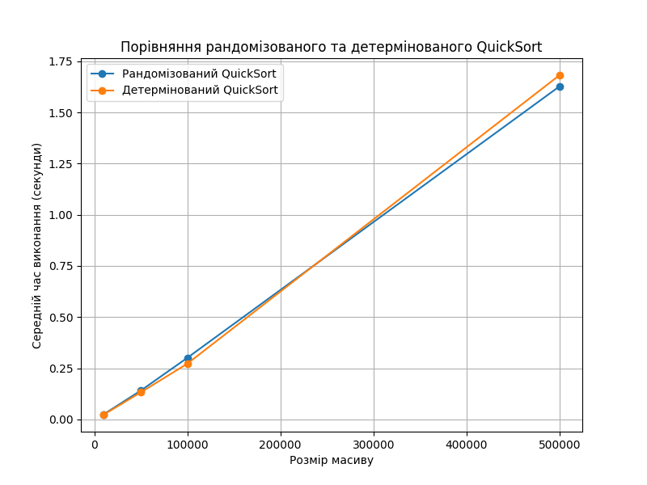

# Аналіз ефективності рандомізованого та детермінованого QuickSort

## Результати тестування:

### Час виконання для різних розмірів масиву:

| Розмір масиву | Рандомізований QuickSort (с) | Детермінований QuickSort (с) |
| ------------- | ---------------------------- | ---------------------------- |
| 10,000        | 0.0248                       | 0.0231                       |
| 50,000        | 0.1412                       | 0.1325                       |
| 100,000       | 0.3011                       | 0.2725                       |
| 500,000       | 1.6274                       | 1.6822                       |

## Аналіз графіка:

- **Рандомізований QuickSort** показує схожу продуктивність із **детермінованим
  QuickSort**.
- **Час виконання зростає лінійно** зі збільшенням розміру масиву, що відповідає
  очікуваній часовій складності \( O(n \log n) \).
- Для малих масивів (10,000 елементів) **детермінований QuickSort** трохи
  швидший.
- Для великих масивів (500,000 елементів) **рандомізований QuickSort**
  демонструє незначну перевагу завдяки зменшенню ризику найгіршого випадку.

## Переваги та недоліки:

- **Рандомізований QuickSort**:
  - Переваги:
    - Зменшує ймовірність найгіршого випадку.
    - Ефективний для масивів із повторюваними значеннями.
  - Недоліки:
    - Додаткові витрати на рандомізацію.
- **Детермінований QuickSort**:
  - Переваги:
    - Простота реалізації.
    - Трохи швидший для невеликих масивів.
  - Недоліки:
    - Можливість найгіршого випадку (\( O(n^2) \)) на вже відсортованих або
      специфічно впорядкованих даних.

## Висновок:

Рандомізований QuickSort має перевагу для великих масивів і є більш стабільним у
середньому випадку. Детермінований QuickSort може бути корисним для невеликих
даних, де стабільність не є критичною.

## Графік:

